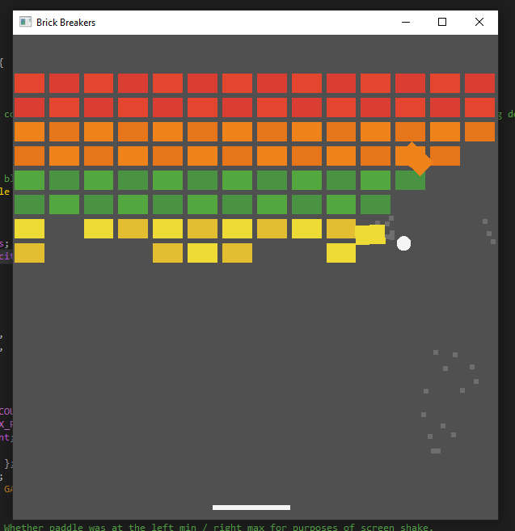

# Brick Breakers

Typical block breaking arcade game clone in raylib. I am very much a believer in the "make a simple game from start to finish to learn the ropes of an engine" practice!

Credit to raylib by @raysan5, ChipTone by SFB Games, and special thanks to [Glenn Fiedler's blog post about RK4 integration](https://gafferongames.com/post/integration_basics/).

Using CMake to build is optional, but a default raylib CMakeLists example is included.
